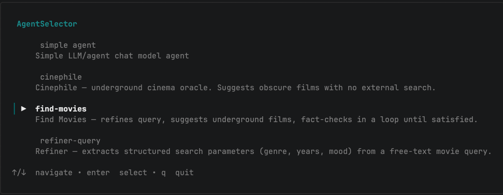
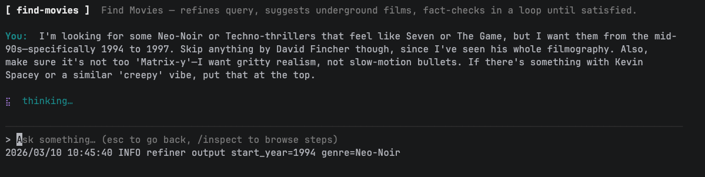
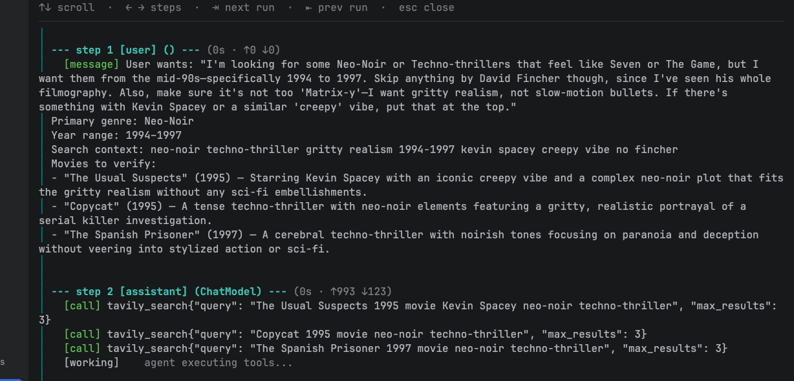
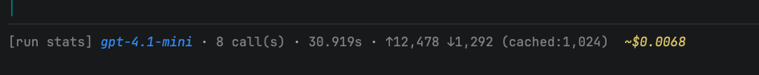
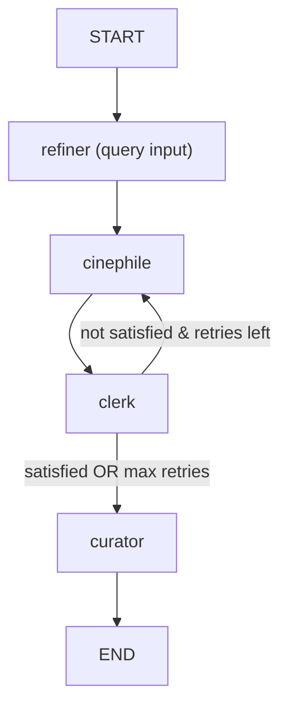
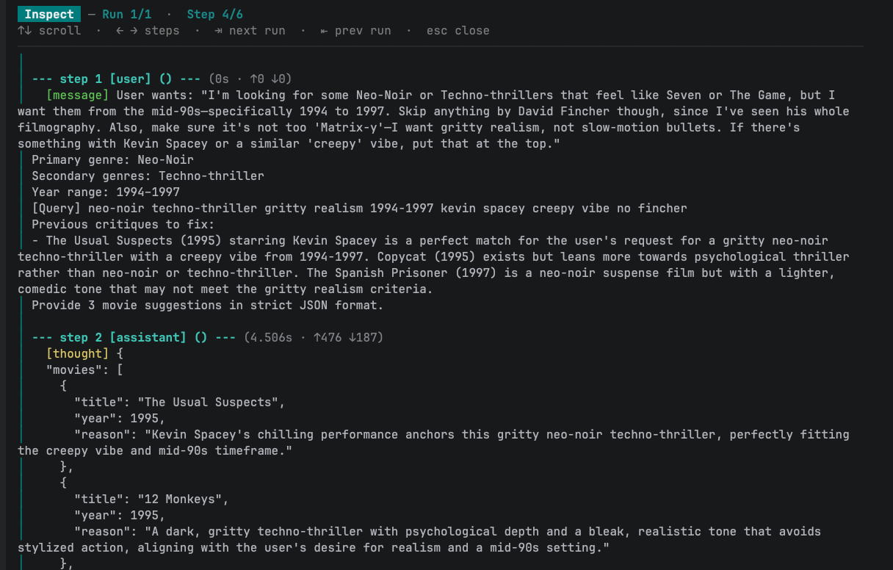
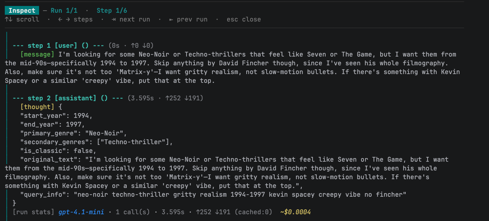
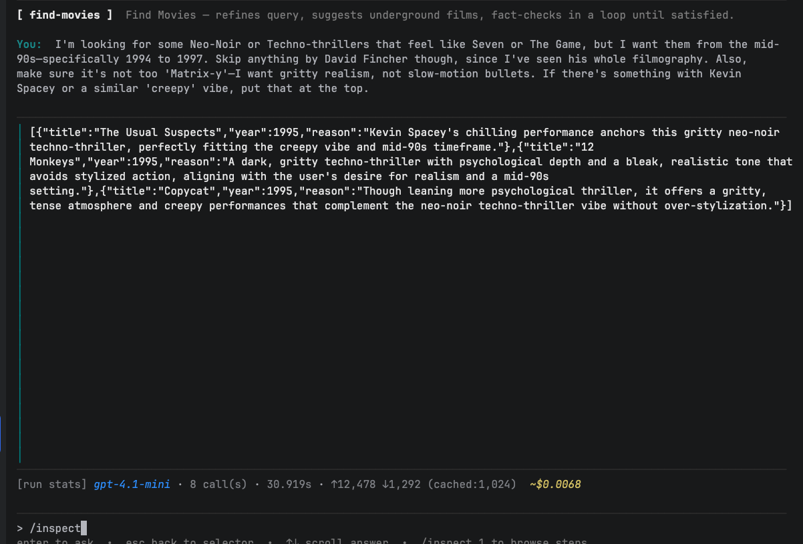

# AgentMonitor

A Go-based observability playground for inspecting AI agent reasoning, costs, and pipelines.

Built on the [CloudWeGo Eino](https://github.com/cloudwego/eino) framework, AgentMonitor provides a transparent environment to run, test, and debug multi-step agentic workflows.

---

## The Problem: Debugging the "Black Box"

When building agentic pipelines in Go, the biggest hurdle is visibility. Most developers default to grepping logs or scattering `fmt.Println` calls throughout their code. While this works for a simple "Prompt → Response" flow, it becomes unmanageable for long-running agentic scenarios.

In complex loops, standard logging makes it nearly impossible to track:

- **The "Why"**: Which specific reasoning step led the agent to a wrong conclusion?
- **The "How Much"**: What was the cumulative token cost of a 5-step reflexion loop?
- **The "What"**: Which tool was called, with what arguments, and what was the raw return?

AgentMonitor help to solve this by leveraging two specific tools:

- [agentmeter](https://github.com/erlangb/agentmeter) — a framework-agnostic library for tracking token usage, costs, and reasoning steps.
- [agentmeter Eino adapter](https://github.com/erlangb/agentmeter/tree/main/adapters/eino) — a driver that hooks into Eino's callback system to intercept every node execution.

**AgentMonitor is the playground where all of this comes together: a structured, testable agent runner with a built-in reasoning trace you can actually read.**

---

## Choosing a Use Case

At startup, both runners present a menu of available pipelines:



| Use case | What it does |
|---|---|
| Simple LLM | Direct GPT call, no tools |
| Cinephile | Structured extraction of movie search params from free text |
| FindMovies | Full reflexion pipeline: refiner → cinephile → clerk (Tavily) → curator |
| Refiner Query | Standalone query refiner for inspection |

---

## Visibility in Action

Structured reasoning trace provided by the agentmeter integration.

After every query, the runner dumps the full reasoning trace via `printer.PrintHistory(meter.History())`. For a multi-step pipeline like FindMovies (described below), this means you can watch every node, token count, and decision in sequence:





---

## Project Architecture

The application is designed so that any new use case can be easily written and run. Whether you are testing a simple LLM call or a complex multi-agent graph, the architecture remains plug-and-play.

| Layer | Responsibility |
|---|---|
| **UI** | Interchangeable runners (TUI or Terminal). Implements a simple `Runner` interface. |
| **Use Cases** | The entry point. Any custom pipeline implementing `UseCase.Run` can be registered and executed. |
| **Agent Nodes** | Atomic units of logic. Wraps Eino chains or `adk.Agent` to handle state mutations. `Invoke` is the test seam. |
| **Infrastructure** | Management of model providers, MCP clients, and configuration via Koanf. |

---

## Example Agentic Scenario: FindMovies

While you can write and run any use case, `FindMoviesUseCase` is included as a deep example of an agentic reflexion pipeline. It takes a free-text movie request and returns a curated, fact-checked list using a multi-stage loop:



- **Refiner**: Extracts structured search parameters from raw text.
- **Cinephile**: Drafts an initial list of films.
- **Clerk**: A tool-calling agent that fact-checks the list using Tavily.
- **Reflexion Loop**: If the Clerk identifies inaccuracies, it triggers a retry back to the Cinephile.
- **Curator**: Finalizes and prunes the results.

The reflexion loop runs inside an Eino `compose.Graph` with a branch condition on the shared state. The Clerk uses `adk.Agent` for its tool-calling loop (model → Tavily → model). Everything else uses `compose.Chain` for simple linear steps.





---

## Getting Started

### Prerequisites

- Go 1.25+
- [mockery](https://github.com/vektra/mockery) (for `make mocks`)
- OpenAI API key
- Tavily API key (for the FindMovies use case)

### Installation

```bash
# 1. Setup environment
cp .env.dist .env
# fill in your keys in .env

# 2. Install dependencies and generate mocks
make deps
make mocks

# 3. Launch the TUI
make run-tea
```

### Run

```bash
make run-tea        # bubbletea TUI
make run-terminal   # plain terminal
```

Or with the binary:

```bash
make build-agent-monitor
./bin/agent-monitor -runner=tea
./bin/agent-monitor -runner=terminal
```

### Dev

```bash
make fmt      # format
make vet      # vet
make test     # tests
make mocks    # regenerate mocks
```

### Config

Configuration lives in `config/config.yaml`. Secrets are set via environment variables:

| Env var | Description |
|---|---|
| `APP_ENV_MODELS__OPENAI__API_KEY` | OpenAI API key |
| `TAVILY_API_KEY` | Tavily MCP API key |

---

## Tech Stack

- [Eino](https://github.com/cloudwego/eino) — AI orchestration (`compose.Chain`, `compose.Graph`, `adk.Agent`, callbacks)
- [agentmeter](https://github.com/erlangb/agentmeter) — token/cost tracking and reasoning trace
- [agentmeter Eino adapter](https://github.com/erlangb/agentmeter/tree/main/adapters/eino) — Eino callback integration
- [bubbletea](https://github.com/charmbracelet/bubbletea) — TUI
- [koanf](https://github.com/knadh/koanf) — config
- [sonic](https://github.com/bytedance/sonic) — JSON
- [testify](https://github.com/stretchr/testify) + [mockery](https://github.com/vektra/mockery) — testing