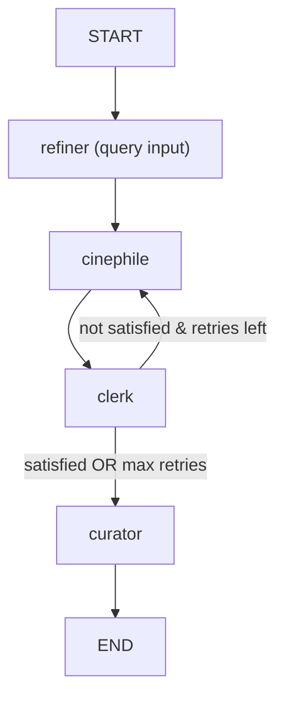

# AgentMonitor

A Go application for running and inspecting AI agent use cases, built on the [Eino](https://github.com/cloudwego/eino) framework by CloudWeGo.

---

## Why this project exists

While exploring agentic programming in Go, I kept running into the same problem: **how do you know what's actually happening inside an agent pipeline?**

You send a prompt. A few seconds pass. You get a result. But what happened in between?

- How many LLM calls were made?
- Which tools did it call?
- How much did it cost?
- What was the reasoning at each step?

As a developer I want this information to be clear — especially while building, when you need to run the whole pipeline or individual steps and understand exactly what's going on. **Most frameworks give you none of that by default.** You're left grepping logs or scattering `fmt.Println` calls around, which quickly becomes unmanageable for multi-step pipelines.

So I built two things to fix this:

- A small, framework-agnostic **observability library** called [agentmeter](https://github.com/erlangb/agentmeter) that hooks into your agent calls and tracks token usage, cost, and reasoning steps.
- For this project I chose [Eino](https://github.com/cloudwego/eino), so I also wrote a simple [Eino adapter](https://github.com/erlangb/agentmeter/tree/main/adapters/eino) that wires agentmeter into Eino's callback system with minimal setup.

**AgentMonitor is the playground where all of this comes together: a structured, testable agent runner with a built-in reasoning trace you can actually read.**

---

## What you can see

The screenshots below show the full pipeline for the FindMovies use case in action.

After every query, the runner calls `printer.PrintHistory(meter.History())` and dumps the full reasoning trace. For a multi-step pipeline like FindMovies, this means you can watch:

- The **refiner** extracting structured search params from your raw text
- The **cinephile** suggesting a first draft of films
- The **clerk** fact-checking them via Tavily search (you can see which tools it called and why)
- The **clerk deciding** whether to loop back to the cinephile or accept the list
- The **curator** pruning and finalising the result

Every step shows token usage and cost. You don't have to guess whether the reflexion loop ran twice or four times — you can read it.

```
docs/thinking.png          — reasoning trace for a single query
docs/clerk_tavily_reason.png   — clerk's tool calls and verdicts
docs/stats.png             — token/cost summary after the run
```


---

## The structure

The code is split into four layers:

**UI** — two interchangeable runners: a bubbletea TUI and a plain terminal. Both implement `Runner`. They know nothing about LLMs or agents.

**Use cases** — each use case implements `UseCase.Run(ctx, input) → string`. It owns one complete pipeline. The use case is the seam between the UI and the framework.

**Agent nodes** — the actual LLM logic. Each node is a Go struct wrapping a compiled Eino chain or `adk.Agent`. Nodes take a typed state, call a model, mutate state, return it. `Invoke` is the test seam.

**Infrastructure** — factories for model and MCP client creation, config loaded once via koanf, env vars expanded at startup.

---

## The main pipeline: FindMovies

The most complete example is `FindMoviesUseCase`. It takes a free-text movie request and returns a curated, fact-checked list of underground films using a reflexion loop.



The reflexion loop runs inside an Eino `compose.Graph` with a branch condition on the shared state. The clerk uses `adk.Agent` for its tool-calling loop (model → Tavily → model). Everything else uses `compose.Chain` for simple linear steps.

```
docs/movie_finder_critics_and_refinement.png — the full loop in action
docs/inspect_query_refiner.png               — refiner extracting structured params
docs/result.png                              — final curated output
```


---

## How to run locally

### Requirements

- Go 1.25+
- [mockery](https://github.com/vektra/mockery) (for `make mocks`)
- OpenAI API key
- Tavily API key (for the FindMovies use case)

### Setup

```bash
cp .env.dist .env
# fill in your keys in .env
make deps
```

### Run

```bash
make run-tea        # bubbletea TUI
make run-terminal   # plain terminal
```

Or with the binary:

```bash
make build-agent-monitor
./bin/agent-monitor -runner=tea
./bin/agent-monitor -runner=terminal
```

### Dev

```bash
make fmt      # format
make vet      # vet
make test     # tests
make mocks    # regenerate mocks
```

### Config

Configuration lives in `config/config.yaml`. Secrets are set via environment variables:

| Env var | Description |
|---|---|
| `APP_ENV_MODELS__OPENAI__API_KEY` | OpenAI API key |
| `TAVILY_API_KEY` | Tavily MCP API key |

---

## Choosing a use case

At startup, both runners present a menu of available pipelines:

```
docs/agent_selector.png
```


| Use case | What it does |
|---|---|
| Simple LLM | Direct GPT call, no tools |
| Cinephile | Structured extraction of movie search params from free text |
| FindMovies | Full reflexion pipeline: refiner → cinephile → clerk (Tavily) → curator |
| Refiner Query | Standalone query refiner for inspection |

---

## Tech stack

- [Eino](https://github.com/cloudwego/eino) — AI orchestration (`compose.Chain`, `compose.Graph`, `adk.Agent`, callbacks)
- [agentmeter](https://github.com/erlangb/agentmeter) — token/cost tracking and reasoning trace printer
- [bubbletea](https://github.com/charmbracelet/bubbletea) — TUI
- [koanf](https://github.com/knadh/koanf) — config
- [sonic](https://github.com/bytedance/sonic) — JSON
- [testify](https://github.com/stretchr/testify) — tests
- [mockery](https://github.com/vektra/mockery) — mock generation
